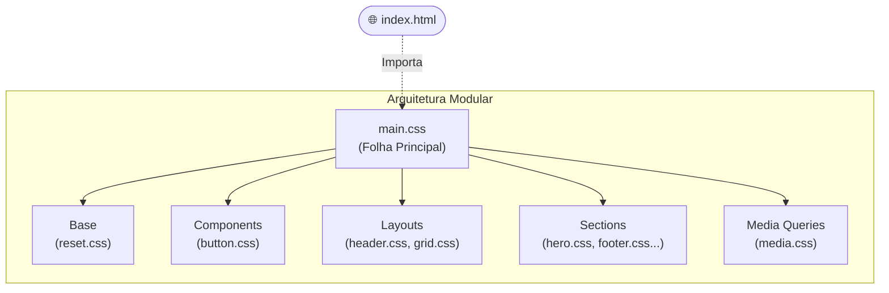
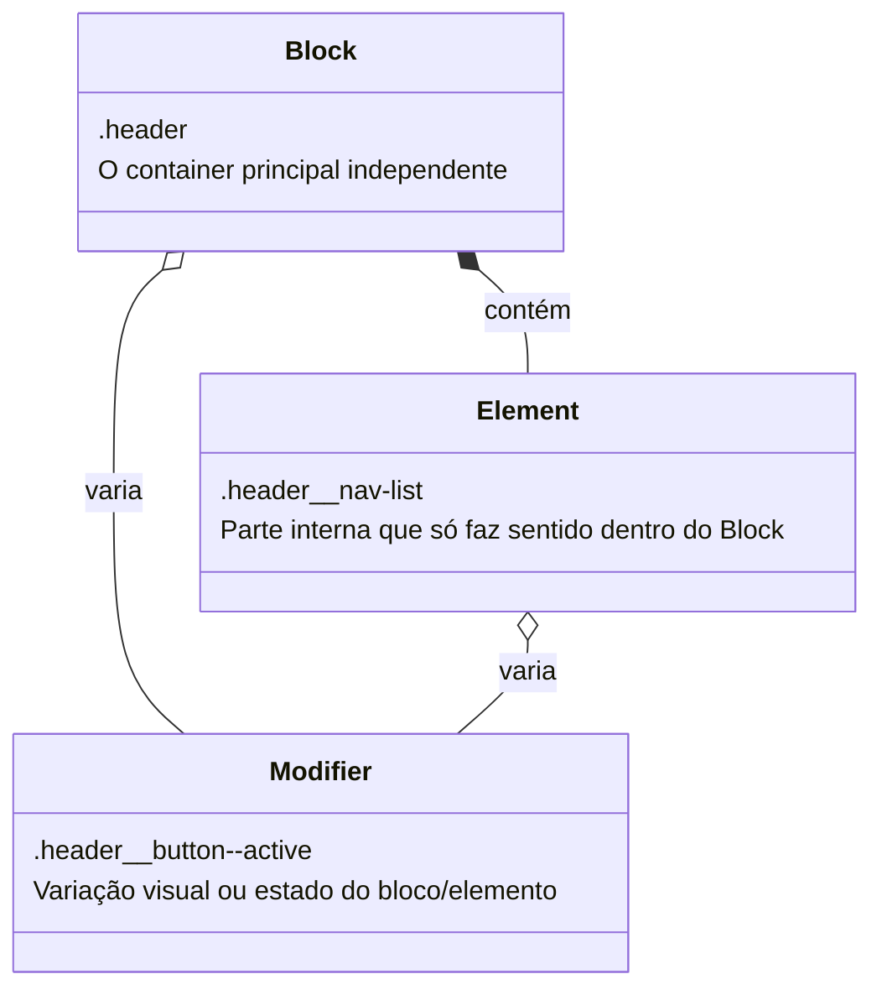
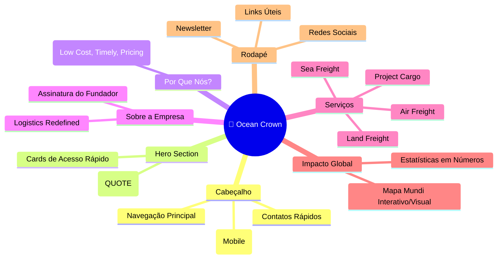

# 🚢 Ocean Crown - Logistics Landing Page

<div align="center">

</div>

> Landing Page responsiva e moderna desenvolvida para a **Ocean Crown**, uma empresa fictícia de logística e agenciamento de cargas internacionais. O projeto foi construído utilizando **HTML5 Semântico** e **CSS3** puro, aplicando uma arquitetura de estilos modular e a metodologia **BEM (Block, Element, Modifier)** para organização de classes.

---

## 📋 Sumário

* [Visão Geral](https://www.google.com/search?q=%23-vis%C3%A3o-geral)
* [Estrutura do Projeto](https://www.google.com/search?q=%23-estrutura-do-projeto)
* [Arquitetura CSS](https://www.google.com/search?q=%23%EF%B8%8F-arquitetura-css)
* [Metodologias e Padrões](https://www.google.com/search?q=%23-metodologias-e-padr%C3%B5es)
* [Mapa da Página](https://www.google.com/search?q=%23-mapa-da-p%C3%A1gina)
* [Tecnologias Utilizadas](https://www.google.com/search?q=%23-tecnologias-utilizadas)
* [Qualidade de Código](https://www.google.com/search?q=%23-qualidade-de-c%C3%B3digo)
* [Como Executar](https://www.google.com/search?q=%23-como-executar)

---

## 🔎 Visão Geral

O projeto **Ocean Crown** é uma interface Front-end focada em apresentar serviços de transporte global (Frete Aéreo, Marítimo, Terrestre e Cargas de Projeto). O desenvolvimento priorizou as melhores práticas de estruturação de marcação e estilização em cascata sem o uso de frameworks, garantindo alta performance e controle total sobre o design.

O projeto foi construído com foco em:

* **Semântica estrutural** para melhorar a acessibilidade e SEO.
* **Modularização do CSS** dividindo responsabilidades entre base, layout, seções e componentes.
* **Responsividade** garantindo adaptação a diferentes tamanhos de tela (Mobile, Tablet, Desktop).
* **Código limpo** com nomenclatura previsível e de fácil manutenção.

---

## 📁 Estrutura do Projeto

A organização de pastas segue uma abordagem escalável para assets e folhas de estilo:

```text
├── 📁 public
│   ├── 📁 assets
│   │   └── 📁 images           # Imagens otimizadas separadas por seções (hero, about, global...)
│   ├── 📁 components
│   │   └── 🎨 button.css       # Estilos isolados para botões reutilizáveis
│   └── 📁 styles
│       ├── 📁 base
│       │   └── 🎨 reset.css    # Resets de CSS (margens, box-sizing, fontes padrão)
│       ├── 📁 layouts
│       │   ├── 🎨 grid.css     # Sistema de grids geral
│       │   └── 🎨 header.css   # Estilização do cabeçalho e navegação
│       ├── 📁 sections
│       │   ├── 🎨 about.css    # Seção Sobre Nós
│       │   ├── 🎨 company.css  # Seção Informações da Empresa
│       │   ├── 🎨 features.css # Cards de características e serviços rápidos
│       │   ├── 🎨 footer.css   # Rodapé completo
│       │   ├── 🎨 hero.css     # Banner principal de destaque
│       │   ├── 🎨 services.css # Grid detalhado de serviços
│       │   ├── 🎨 why_us.css   # Seção "Por que nos escolher"
│       │   └── 🎨 world.css    # Seção de estatísticas globais
│       ├── 🎨 main.css         # Arquivo principal que indexa as importações
│       └── 🎨 media.css        # Centralização de Media Queries (Responsividade)
└── 🌐 index.html               # Arquivo principal e único de marcação

```

---

## 🏗️ Arquitetura CSS

O projeto abandona o conceito de um arquivo `style.css` gigante e monolítico, adotando uma estrutura modular fortemente inspirada em padrões como o *ITCSS* e o *Sass 7-1 pattern* (adaptado para CSS puro).



### Responsabilidades dos Estilos

| Pasta/Arquivo | Responsabilidade |
| --- | --- |
| **base** | Regras globais, normalização de browsers e definições de tipografia base. |
| **layouts** | Estruturas macro da página, como grid container geral e o layout do cabeçalho. |
| **components** | Elementos de UI discretos e reutilizáveis (ex: botões, inputs, modais). |
| **sections** | Estilos específicos amarrados a blocos de conteúdo únicos da landing page. |
| **media.css** | Regras de adaptação (breakpoints) para dispositivos móveis e tablets. |

---

## 🧬 Metodologias e Padrões

### BEM (Block, Element, Modifier)

A nomenclatura de classes CSS utiliza o padrão **BEM** para evitar conflitos de especificidade e tornar o CSS auto-documentado.



**Exemplo aplicado no projeto:**

```html
<header class="header"> <div class="header__top"> <a href="/" class="header__brand"> <span class="header__title">Name company</span> </a>
  </div>
</header>

```

---

## 🗺️ Mapa da Página

A interface foi estruturada de forma lógica para guiar a jornada do usuário e apresentar a empresa de ponta a ponta.



---

## 🛠️ Tecnologias Utilizadas

<div align="center">

</div>

* **HTML5**: Estruturação baseada em tags semânticas (`<header>`, `<main>`, `<section>`, `<nav>`, `<footer>`).
* **CSS3**: Estilização visual, uso de `Flexbox` e `CSS Grid` para layouts complexos, e `Media Queries` para responsividade.
* **FontAwesome 7.0.1**: Biblioteca utilizada via CDN para a inserção de ícones vetorizados escaláveis.

---

## 🔍 Qualidade de Código e Boas Práticas

Durante o desenvolvimento da interface, os seguintes critérios de qualidade foram aplicados:

* ✅ **Sem `<style>` inline**: Toda a estilização está devidamente separada nos arquivos CSS.
* ✅ **Acessibilidade Básica**: Uso das tags semânticas corretas ao invés de excesso de `<div>`s (`divitis`).
* ✅ **Otimização de Assets**: Uso de formatos modernos para web, como `.avif` e `.svg`.
* ✅ **Menu Responsivo sem JS**: O menu hambúrguer no mobile é controlado nativamente via CSS puro através de um hack de formulário (Checkbox Hack): `<input type="checkbox" name="menu" id="menu" />`.

---

## 🚀 Como Executar

Por ser um projeto puramente estático (Client-side sem processamento build-step), a execução é imediata.

### Pré-requisitos

* Um navegador web moderno (Chrome, Firefox, Edge, Safari).
* Opcional: Uma extensão como o **Live Server** no VS Code para hot-reload.

### Passos

1. Clone o repositório para sua máquina local:

```bash
git clone https://github.com/seu-usuario/ocean-crown-logistics.git

```

2. Navegue até a pasta do projeto:

```bash
cd ocean-crown-logistics

```

3. Dê um duplo clique no arquivo `index.html` para abri-lo diretamente no navegador, ou inicie pelo **Live Server** no seu editor de código.

---

<div align="center">
<sub>Projeto Acadêmico Front-end desenvolvido no formato estruturado para o módulo SENAI.</sub>
</div>

